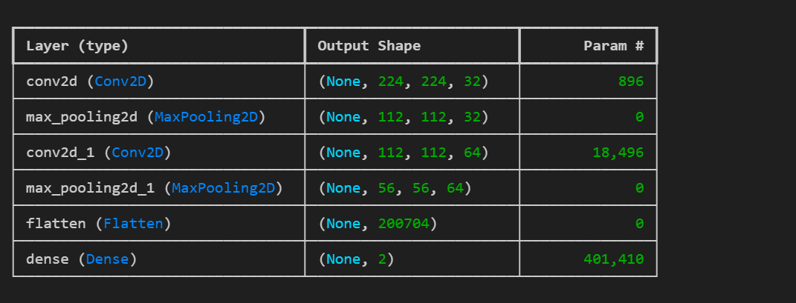
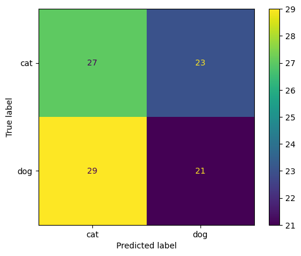
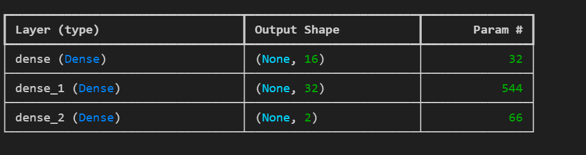
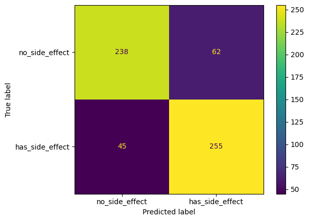

# Neural Network Project: Cat vs. Dog Classification and Medical Side Effects Prediction

## Overview

This project contains two separate neural networks developed using Keras:

1. **Cat vs. Dog Classification:** A convolutional neural network (CNN) to differentiate between images of cats and dogs.
2. **Medical Side Effects Prediction:** A neural network to predict medical side effects for young and old individuals.

## Project Structure

- `cnn_cat_dog.ipynb`: Jupyter notebook containing the implementation of the cat vs. dog classification model.
- `med_neural_network.ipynb`: Jupyter notebook containing the implementation of the medical side effects prediction model.
- `data/`: Directory where datasets for both models are stored.
- `models/`: Directory to save the trained models.
- `README.md`: Project documentation.

## Requirements

- Python 3.7+
- TensorFlow 2.x
- Keras
- NumPy
- Pandas
- Matplotlib
- Jupyter Notebook

You can install the required packages using:

- bash

```sh
pip install tensorflow keras numpy pandas matplotlib jupyter
```

## Running the Notebooks

1. **Cat vs. Dog Classification:**
    - Open the `cnn_cat_dog.ipynb` notebook.
    - Ensure you have the dataset in the `data/` directory.
    - Data can be download from [kaggle](https://www.kaggle.com/competitions/dogs-vs-cats/data)
    - Run all cells to train and evaluate the model.
    
    

    > [!NOTE]
    > The cat vs. dog classification model is likely overfitting and should not be used in a production environment. It is intended for educational purposes only to demonstrate the construction and training of a CNN.

2. **Medical Side Effects Prediction:**
    - Open the `med_neural_network.ipynb` notebook.
    - Ensure you have the dataset in the `data/` directory.
    - Run all cells to train and evaluate the model.
    
    

## Credits

The implementation of the Cat vs. Dog Classification model is based on the tutorial by Nicholas Renotte. You can watch the tutorial [here](https://youtu.be/qFJeN9V1ZsI?feature=shared).
